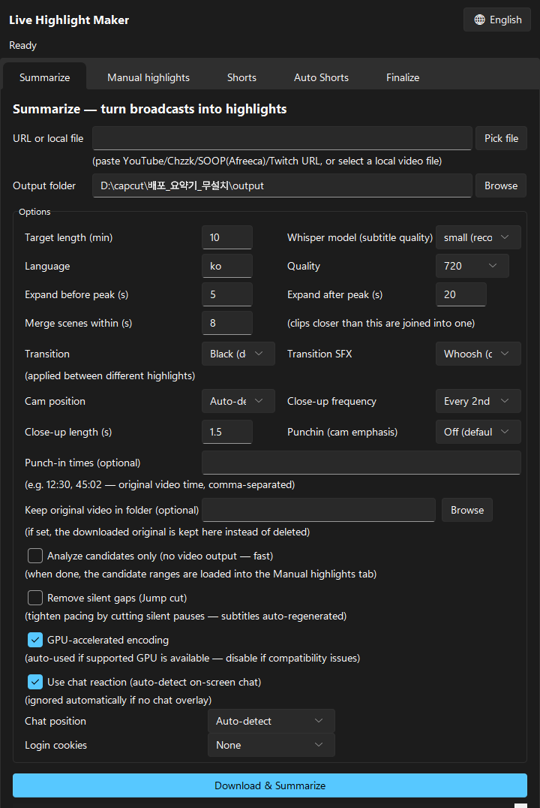
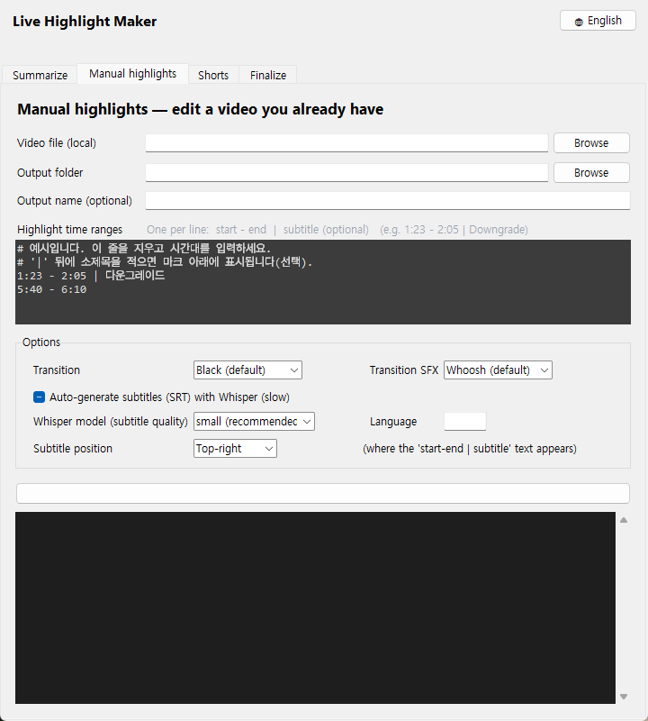
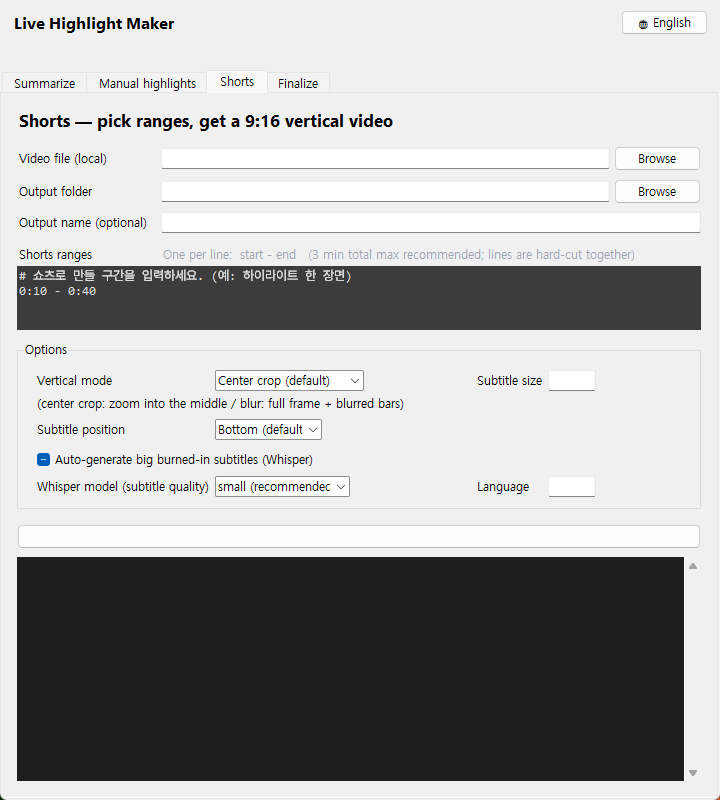
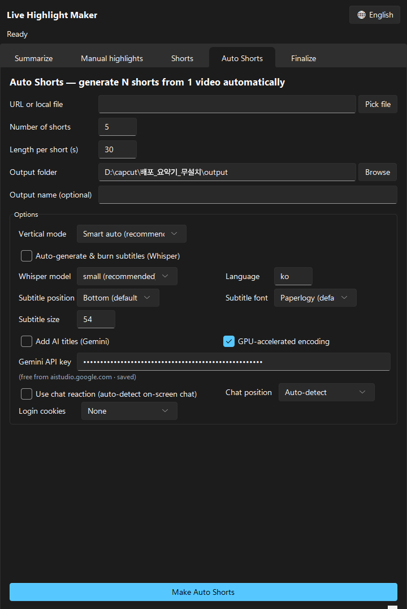
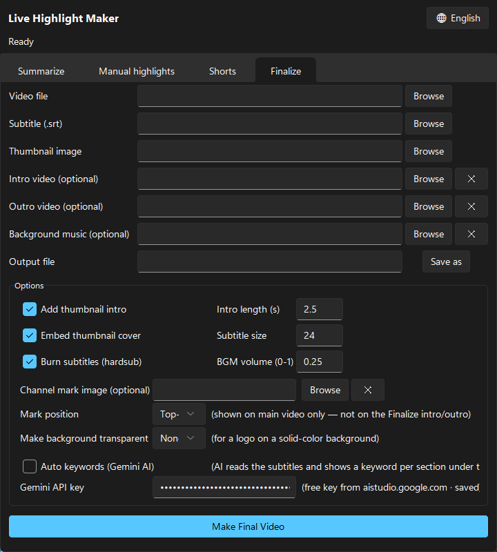

<div align="center">

[한국어](README.md) · **English**


# 🔥 Live Highlight Maker (Portable)

**A video tool that automatically analyzes long live-stream VODs (YouTube, Chzzk, SOOP, Twitch), extracts only the best moments (highlights),**
**and layers on subtitles, transitions and background music to produce an upload-ready finished video.**

Powered by faster-whisper speech recognition for rapid subtitles (3x faster than before) · **chat-reaction & voice-based highlight detection** · **GPU-accelerated encoding (auto-detected)** · **closeup transitions (auto-detect camera)** and ffmpeg · comes with a **graphical UI (GUI)** so you don't need to know Python · **modern dark theme with Windows 11 styling (sv-ttk)** · **automatic settings save** · **automatic update notifications**

</div>

---

## 🎯 What is this?

Rewatching and editing an hours-long live stream from scratch is exhausting. This tool automates that process.

> **Just paste a YouTube, Chzzk, SOOP, or Twitch VOD URL → it finds moments where the streamer's voice & chat reactions peaked (highlights) on its own → cuts them into a short summary video at your target length → and even adds subtitles.**

It was built with game-stream highlight editing in mind, but works just as well on any live stream or video.

---

## ✨ Key features

The GUI (`요약기_gui.py`) has five tabs. A **KO/EN language toggle button (🌐)** sits in the top-right corner so you can switch the interface language anytime.

### 1️⃣ Summarize tab — turn a stream into highlights

- **Paste a VOD URL** *or* **load a video file you recorded yourself**, and it automatically finds the **high audio-energy highlight segments**. (URLs are downloaded first; local files skip the download and are analyzed directly.)
- Picks highlights to match your target length (e.g. 10 min) and builds a **summary video**.
- Auto-generates **subtitles (SRT)** with Whisper, plus a **YouTube chapters text** (`_chapters.txt`) you can paste straight into the video description.
- Turn on **"Analyze candidates only"** to skip building the video and just extract candidate highlight ranges quickly — they are **auto-loaded into the Manual highlights tab** so you can review and adjust them before building.
- Lets you add **screen transitions** (none / fade to black / white flash) and **transition SFX** (none / whoosh / swoosh / beep / pop / impact) between highlights.
- Set a **keep-original folder** and the downloaded source video is preserved instead of deleted → you can re-edit it later in the **Manual highlights tab**.
- **Auto silence cutting (jump cuts)** option removes silent gaps to tighten pacing. (Subtitles are auto-regenerated to stay in sync.)
- Output: `title_summary.mp4` (summary video), `title_summary.srt` (subtitles), `title_chapters.txt` (YouTube chapters)

### 2️⃣ Manual highlights tab — your video + your chosen ranges

- Build a summary video from a **local video file you already have** plus **highlight time ranges you type in yourself** — skipping the download and audio-analysis steps.
- Enter one range per line as `start - end`. `SS` / `MM:SS` / `HH:MM:SS` are all supported, e.g. `1:23 - 2:05`, `83 - 125`, `00:01:23,000 --> 00:02:05,000` (SRT style).
- Add `| subtitle` after any line (e.g. `1:23 - 2:05 | Downgrade`) to show a **subtitle** in a screen corner during that highlight (position selectable).
- Just like the Summarize tab, you can add **transitions / SFX**, and optionally auto-generate **subtitles (SRT)**.
- **Auto silence cutting (jump cuts)** option removes silent gaps to tighten pacing. (Subtitles are auto-regenerated to stay in sync.)
- Output: `name_highlight.mp4`, `name_highlight.srt` (when subtitles are on), `name_chapters.txt` (YouTube chapters)

### 3️⃣ Shorts tab — pick a scene, get a 9:16 vertical video

- Pick any range(s) from a video and export a **1080x1920 vertical short** (YouTube Shorts / Instagram Reels / TikTok spec).
- Five vertical modes: **smart auto (recommended)** (analyzes motion and frames the action automatically) / **center crop** (zoom into the middle) / **left crop** / **right crop** / **blur background** (full frame + blurred bars).
- Turn on **auto subtitles** to burn in Whisper captions in the **big bold shorts style**. Both the caption **size** and **position (bottom / center / top)** are adjustable so they don't cover the footage.
- Multiple ranges are hard-cut together. (3 minutes total max recommended.)
- Output: `name_shorts.mp4` (vertical video), `name_shorts.srt` (when subtitles are on)

### 4️⃣ Auto Shorts tab — 1 video → many shorts automatically

- **Paste a VOD URL** or **load a video file**, and it auto-detects the top-N highlights and **generates multiple 9:16 vertical shorts in one go**.
- Set the **number of shorts** (N) and **length per short** (seconds), and it finds the audio-energy peaks and auto-converts them to vertical shorts.
- Pick a vertical mode (smart auto recommended) and it applies to all shorts.
- **Auto subtitles** on/off, **subtitle position, size**, and **font** are adjustable.
- **Add AI titles (Gemini)** option: AI analyzes each short's audio and auto-generates a title to burn into the video. (needs free Gemini API key)
- Output: `name_short_01.mp4`, `name_short_02.mp4`, … (+ `.srt` subtitle files)

### 5️⃣ Finalize tab — polish it for upload

- Combines your **summary video + subtitles (SRT) + thumbnail (+ optional intro/outro/BGM/logo)** into a single finished mp4.
- **Auto-generate intro teaser** — automatically picks 2-4 of the hottest moments from the main video (1.5 seconds each) to create a preview and places it at the very start of the finished video. (YouTube-style cold open with white flash into main video)
- **Burns subtitles into** the picture (hardsub) → they show up on any player.
- Uses the thumbnail as an **① intro clip** at the front and also embeds it as **② the mp4 cover art**.
- Lets you attach a separate **intro / outro video** (a standalone mp4) before and after the main clip. Even with different resolution/aspect ratio, it's auto-converted to the main clip's spec and stitched in.
- Add **background music (BGM)** and it plays **only over the main video** (not the intro/outro clips or thumbnail intro). It's automatically **looped (if short) or cut (if long)** to the main video's length, at a lowered volume (default 0.25) so it mixes under the original speech instead of covering it.
- Add a **channel mark (logo image)** in any corner (top-left / top-right / bottom-left / bottom-right). The mark is burned onto the **main video only** — it won't appear on the intro/outro clips. A solid-background logo can be **keyed out** (white/black) to make it transparent.
- **Auto keywords (Gemini AI)** — with a free Gemini API key, the AI reads the subtitles and extracts a **key keyword per section**, shown **automatically under the mark** (e.g. "Rune farm", "Boss fight" per section).
- **Loudness normalization** — matches the wildly-varying loudness of stream recordings to the **YouTube standard (-14 LUFS)** precisely (fixes "too quiet / too loud"; accurate 2-pass processing).
- Intro length, subtitle size, BGM volume, and each option can be toggled on/off.

---

## 💡 Recommended workflow

AI subtitles aren't perfect. Follow the order below to produce a **finished video with polished subtitles too**.

<div align="center">

</div>

```
① Summarize tab  →  auto-creates summary video (.mp4) + subtitle file (.srt)
        ↓
② Open the .srt in a text editor and fix wrong words/phrases by hand
        ↓
③ Finalize tab  →  combine the edited .srt + thumbnail + summary video. Done!
```

> **Tip:** Open the SRT file with Notepad (or Notepad++). Just fix the subtitle text and save. You don't need to touch the timecodes (the numbers).

---

## 🚀 3-minute quick start

1. **Double-click `실행.bat`** → the program window opens.
2. **`Summarize` tab** → paste the VOD URL → click **"Download & Summarize"** → the summary video (.mp4) and subtitles (.srt) are created automatically.
3. *(optional)* Open the **`.srt`** in a text editor, fix any wrong words, and save.
4. **`Finalize` tab** → select the video you just made + subtitles + thumbnail → click **"Make final video."**
5. The upload-ready **final mp4** is saved. Done! 🎉

> **All settings are saved automatically and restored on the next run.** Target length, transitions, punch-in, chat options, paths, language, and 90+ other options—plus window size—are remembered, so you won't need to reconfigure them for repeat tasks.

### 📌 Header options (common to all tabs)

At the top of the program window, you'll find the following button and checkboxes to control two features:

| Option | Description |
|------|------|
| **Glossary** button | Edit `용어집.txt` in the program folder to add game/stream-specific terms (one per line), and they are automatically used as hints during speech recognition (subtitle generation). (Example: entering game terms like League of Legends, Valorant, Overwatch improves subtitle accuracy) If the file doesn't exist, a default Diablo 2 template is auto-created. Leave it empty to disable hints. |
| **Completion sound** | Play a notification sound when a video task finishes (different sounds for success/failure) — on by default |
| **Open folder on done** | Automatically open the output folder when a task completes — on by default |

---

## 📋 Detailed guide (on-screen)

### STEP 1 — Summarize tab

Below is the actual program screen. Just follow the numbers.

<div align="center">

</div>

| Item | Description | Default |
|------|------|--------|
| URL or local file | Paste the VOD address (YouTube, Chzzk, SOOP, Twitch supported) to summarize, or click **"Pick file"** to load a video you recorded yourself | — |
| Output folder | Where the result files are saved | `output` |
| Target length (min) | Desired length of the summary. With auto silence cutting enabled, the duration of removed silence is predicted in advance and that much additional time is selected, so the final video matches the target length | `10` min |
| Whisper model | Subtitle accuracy (bigger = more accurate, slower) | `small` recommended |
| Language | Spoken language — **set `en` for English videos** to get English subtitles (99 language codes supported, e.g. `ja` for Japanese) | `ko` (Korean) |
| Quality | 360 / 480 / **720** / 1080 | `720` recommended |
| Pre-peak extend (s) | Extra time added before each highlight start | `5` s |
| Post-peak extend (s) | Extra time added after each highlight end | `20` s |
| Scene merge (s) | Segments closer than this are stitched smoothly | `8` s |
| Transition | Between highlights: none / fade to black / white flash / **closeup (camera zoom)** | `fade to black` |
| Camera position | For closeup transitions: **auto-detect** (default) / bottom-right / bottom-left / top-right / top-left | `auto-detect` |
| Closeup frequency | How often to insert closeup cuts: every transition / **1 per 2 transitions** / 1 per 3 transitions (prevents monotony from every-transition repeats) | `1 per 2 transitions` |
| Closeup length (s) | Duration of each closeup cut | `1.5` s |
| Punch-in (camera emphasis) | During highlights, detect audio peaks (streamer reaction moments) and briefly zoom the camera/avatar: off (default) / low / mid / high | `off` |
| Punch-in times (optional) | Specify moments manually in `12:30, 45:02` format (source video timeline, comma-separated). Works alongside auto-detection; times outside highlights are skipped | empty by default |
| Transition SFX | SFX at the transition: none / whoosh / swoosh / beep / pop / impact | `whoosh` |
| Keep-original folder | Folder to preserve the downloaded source video (empty = delete after processing) | empty |
| GPU-accelerated encoding | Auto-detects and uses graphics card (NVIDIA/Intel/AMD) for fast hardware encoding (uncheck if issues) | on |
| Auto silence cutting | Remove silent gaps to tighten pacing (subtitles auto-regenerated). When enabled, automatically compensates to match the target length | off |
| Analyze candidates only | Skip building the video; extract candidate ranges and **auto-fill the Manual highlights tab** (skips Whisper, so it's fast) | off |
| Chat reaction boost | Amplify the highlight score when on-screen chat erupts (auto-disabled if no chat detected) | on |
| Chat position | Auto-detect / left / right | auto-detect |
| Login cookies | For downloading age-restricted / adult-verified / subscriber-only VODs. Use login cookies from selected browser: off / Chrome / Edge / Whale / Firefox | off |

**Button: click "Download & Summarize"** → download → analyze → edit, all automatic.
When finished, three files appear in the output folder:
- `title_summary.mp4` — summary video
- `title_summary.srt` — subtitle file
- `title_chapters.txt` — YouTube chapters (paste the contents into the description to get chapter markers)

> The medium / large models are downloaded automatically over the internet on first use and stored in the `models` folder.
> Set a **keep-original folder** and the source video is preserved, so you can re-edit it later in the **Manual highlights tab**.

---

### STEP 1-B — Manual highlights tab (build from your own video)

Use this when you want to build a summary from a **video file you already have** plus **time ranges you pick yourself**, instead of downloading a URL and auto-analyzing. (An alternative to the Summarize tab.)

<div align="center">

</div>

| Item | Description | Default |
|------|------|--------|
| Video file | Select the local video (mp4, etc.) to edit | — |
| Output folder | Where the result files are saved | `output` |
| Output name | Result file name (empty = use source filename) | empty |
| Highlight ranges | One `start - end` per line (optional `| subtitle` after it) | — |
| Transition / SFX | Same as the Summarize tab (includes closeup) | `fade to black` / `whoosh` |
| Camera position | For closeup transitions: **auto-detect** (default) / bottom-right / bottom-left / top-right / top-left | `auto-detect` |
| Closeup frequency / length | Same as the Summarize tab (every / 1 per 2 / 1 per 3 transitions · duration in s) | `1 per 2` / `1.5` s |
| Punch-in (camera emphasis) | Briefly zoom the camera/avatar at audio peaks mid-highlight: off / low / mid / high | `off` |
| Punch-in times (optional) | Specify moments manually in `12:30, 45:02` format (source video timeline, comma-separated). Works alongside auto-detection; times outside highlights are skipped | empty by default |
| Subtitle position | Corner where the `| subtitle` text appears | `Top-right` |
| GPU-accelerated encoding | Auto-detects and uses graphics card (NVIDIA/Intel/AMD) for fast hardware encoding (uncheck if issues) | on |
| Auto silence cutting | Remove silent gaps to tighten pacing (subtitles auto-regenerated) | off |
| Generate subtitles | Auto-generate Whisper subtitles (SRT) from the result on/off | off |

Range input supports `SS` / `MM:SS` / `HH:MM:SS`, with an optional `| subtitle`:
```
1:23 - 2:05 | Downgrade
83 - 125
00:01:23,000 --> 00:02:05,000 | Boss fight
```
> Separators `-` `~` `->` `-->` are all accepted, and lines starting with `#` are treated as notes and ignored.
> Text after `|` is shown as a **subtitle** in the chosen corner during that highlight. Omit `|` if you don't need a subtitle.
> To add a channel mark (logo), use the **Finalize tab** — set the mark and subtitle to the same corner and the subtitle sits below the mark.

**Button: click "Make highlights"** → cuts and stitches only the ranges you entered into `name_highlight.mp4` (+ `name_highlight.srt`, `name_chapters.txt`).

> **Tip:** Run the Summarize tab with **"Analyze candidates only"** turned on, and the auto-detected candidate ranges are filled into this tab. Review / adjust them, then just click Make highlights.

---

### STEP 1-C — Shorts tab (vertical video)

Pick one great scene from a landscape video and turn it into a **9:16 vertical video for YouTube Shorts / Reels / TikTok**.

<div align="center">

</div>

| Item | Description | Default |
|------|------|--------|
| Video file | Select the source (or summary) local video | — |
| Shorts ranges | One `start - end` per line (multiple lines are hard-cut together; 3 min total max recommended) | — |
| Vertical mode | Smart auto (recommended) / center crop / left crop / right crop / blur background | `smart auto` |
| Subtitle size | Size of the burned-in captions (in real 1080x1920 pixels) | `54` |
| Subtitle position | Vertical position of the captions: bottom / center / top | `bottom` |
| Subtitle font | Font: Paperlogy / Malgun Gothic | `Paperlogy` |
| Auto subtitles | Burn in big bold Whisper captions on/off | off |
| GPU-accelerated encoding | Auto-detects and uses graphics card (NVIDIA/Intel/AMD) for fast hardware encoding (uncheck if issues) | on |

**Button: click "Make Short"** → `name_shorts.mp4` (1080x1920 vertical) is created.

---

### STEP 1-D — Auto Shorts tab (1 video → many shorts automatically)

Generate multiple vertical shorts from a single video's highlights in one pass. Great for rapidly creating short-form content.

<div align="center">

</div>

| Item | Description | Default |
|------|------|--------|
| URL or local file | VOD address (YouTube, Chzzk, SOOP, Twitch supported) or select a local video file to create shorts from | — |
| Number of shorts | How many shorts to generate (N) | `5` |
| Length per short (s) | Duration of each short | `30` s |
| Output folder | Where result files are saved | `output` |
| Output name (optional) | Result file name (empty = use source filename) | empty |
| Vertical mode | Smart auto (recommended) / center crop / left crop / right crop / blur background | `smart auto` |
| Auto-generate & burn subtitles (Whisper) | Burn Whisper subtitles into the video on/off | off |
| Whisper model | Subtitle accuracy (bigger = more accurate, slower) | `small` recommended |
| Language | Spoken language — **set `en` for English videos** to get English subtitles (99 language codes supported, e.g. `ja` for Japanese) | `ko` (Korean) |
| Subtitle position | Vertical position of the captions: bottom / center / top | `bottom` |
| Subtitle font | Font: Paperlogy / Malgun Gothic | `Paperlogy` |
| Subtitle size | Size of the burned-in captions (in real 1080x1920 pixels) | `54` |
| GPU-accelerated encoding | Auto-detects and uses graphics card (NVIDIA/Intel/AMD) for fast hardware encoding (uncheck if issues) | on |
| Chat reaction boost | Amplify the highlight score when on-screen chat erupts (auto-disabled if no chat detected) | on |
| Chat position | Auto-detect / left / right | auto-detect |
| Login cookies | For downloading age-restricted / adult-verified / subscriber-only VODs. Use login cookies from selected browser: off / Chrome / Edge / Whale / Firefox | off |
| Add AI titles (Gemini) | AI analyzes audio and auto-generates title text to display on/off | off |
| Gemini API key | Paste a free key (saved after first use). See how to get one below | — |

**Button: click "Make Auto Shorts"** → auto-detect highlights → generate N shorts
When finished, output folder contains:
- `name_short_01.mp4`, `name_short_02.mp4`, … (vertical shorts)
- `name_short_01.srt`, `name_short_02.srt`, … (subtitle files, when subtitles are on)

---

### STEP 2 — Edit the subtitle file (.srt) (optional, highly recommended)

Auto-generated subtitles sometimes mishear game-specific terms, names, etc. Reviewing and fixing them before finalizing makes for a much more polished video.

1. In the `output` folder, **open `title_summary.srt` in a text editor**.
2. Fix wrong words or awkward sentences and save (`Ctrl+S`).
3. SRT format example:
   ```
   1
   00:00:03,200 --> 00:00:06,800
   Hello everyone, starting the Diablo 2 walkthrough.

   2
   00:00:07,100 --> 00:00:10,400
   Today I'll clear the Baal waves quickly.
   ```
   → Leave the numbers and timecodes as-is; **edit only the text lines**.

---

### STEP 3 — Finalize tab

Combine the summary video + (edited) subtitles + thumbnail image into an upload-ready final mp4.

<div align="center">

</div>

| Item | Description |
|------|------|
| Video file | Select the `_summary.mp4` made in STEP 1 |
| Subtitle file (SRT) | Select the `.srt` edited in STEP 2 (or the original if unedited) |
| AI Subtitle Fix | Auto-fix subtitle typos, misheard proper nouns, and spacing before hardsubbing on/off |
| Fix Provider | Auto (Gemini free first, auto-switch to ChatGPT on quota exceed) / Gemini only / ChatGPT only |
| ChatGPT API Key | Required only for ChatGPT-based fixing. Get from platform.openai.com (optional) |
| Thumbnail image | Select a `.jpg` / `.png` image (e.g. your YouTube thumbnail) |
| Intro video (optional) | A separate clip to prepend to the main video (leave empty if none) |
| Outro video (optional) | A separate clip to append to the main video (leave empty if none) |
| Background music (optional) | A music file laid under the whole video (`.mp3`/`.m4a`/`.wav`, empty if none) |
| Channel mark image (optional) | Logo image (png/jpg) overlaid on the **main video only** — not on the intro/outro |
| Mark position | Top-left / Top-right / Bottom-left / Bottom-right (default Top-right) |
| Make background transparent | If the logo has a solid background, key out that color (white/black); not needed for a transparent PNG |
| Auto keywords (Gemini AI) | AI reads the subtitles and shows a **keyword per section** under the mark (needs the key below) |
| Gemini API key | Paste a free key (saved after first use). See how to get one below |
| Output file | Where the final file is saved |
| Intro length (s) | How many seconds the thumbnail shows at the front (default `2.5`s) |
| Subtitle size | Font size of the burned-in subtitles (default `24`) |
| Subtitle font | Font: Paperlogy / Malgun Gothic |
| BGM volume | BGM level (0–1), relative to speech (default `0.25`) |
| GPU-accelerated encoding | Auto-detects and uses graphics card (NVIDIA/Intel/AMD) for fast hardware encoding (uncheck if issues) | on |
| Auto intro teaser | Auto-generate a preview from the hottest moments of the main video on/off |
| Teaser clip count | Number of clips in the preview (each 1.5 seconds; default `3`) |
| Teaser cut length (s) | Length of each teaser cut (0.5–5 s) | `1.5` s |
| Add intro | Use the thumbnail as the opening scene on/off |
| Insert cover | Embed the thumbnail as album-art-style cover in the mp4 on/off |
| Burn subtitles | Bake subtitles into the video (hardsub) on/off |
| Impact captions (emphasize shouting moments) | Emphasize subtitles on loud audio peaks with large text centered on screen on/off |
| Impact caption frequency | Frequency of impact caption display (Few / Some / Many) |
| Impact caption size | Impact caption font size (default `64`) |
| Impact caption color | Impact caption color (Yellow / White / Red / Cyan) |
| Impact caption position | Impact caption position (Center / Upper / Lower) |
| Impact caption pop effect | Impact caption pop animation on/off |
| Normalize loudness | Match audio to the YouTube standard (-14 LUFS) on/off |

**Button: click "Make final video"** → everything is merged automatically and the final mp4 is saved.

#### 🔑 How to get a free Gemini API key (for Auto keywords)

"Auto keywords" lets Google's Gemini AI read the subtitles and generate a keyword per section, shown under the mark. It's **completely free** — you just need a free key once.

1. Open **[Google AI Studio – Get API key](https://aistudio.google.com/apikey)** (sign in with a Google account)
2. Click **"Create API key"** → pick a project (or create one) → the key is generated
3. Copy the key (a long string starting with `AIza...`)
4. Paste it into the **"Gemini API key"** field on the Finalize tab → it's saved and auto-filled next time

> - It runs on the **free tier** without enabling billing. One call per video, so the free quota is plenty.
> - The **"Link an API key"** button in the Google account popup is for *billing* — use the **AI Studio** page above instead.
> - The key must start with `AIza...`. Other formats (e.g. `AQ...`) may hit quota errors.
> - If no keywords appear, the Finalize log shows `Gemini 키워드 N개 생성` or an error message.

---

## 🔐 API Key Security Guide

**Important information about safely using and storing your API keys.**

1. **Storage location and transmission path**: API keys are stored only in `gemini_key.txt` / `openai_key.txt` in the program folder. When AI features are used, they are sent only to Google and OpenAI's official API servers (HTTPS). They are never transmitted to or collected by the developer or any third-party servers.

2. **Caution when sharing folders**: Be careful not to include key files when sharing the entire program folder with others or uploading it to the cloud. (Official distribution zips do not include key files.)

3. **Damage mitigation tips**:
   - **OpenAI**: Set a usage limit in your billing settings on platform.openai.com — if your key is leaked, losses are capped at that limit.
   - **Gemini**: The free tier doesn't require payment method linkage, so there's no financial risk if the free key leaks.

4. **If key leaks are suspected**: Immediately revoke the key from the relevant site (aistudio.google.com or platform.openai.com) and generate a new one.

5. **Disclaimer**: You are responsible for storing and using your API keys, and for any charges or losses from key leaks. This program is provided without warranty under the MIT License.

---

## 📥 Installation

### A) Portable build (recommended — no Python needed)
Download the **portable zip (~1 GB)** that bundles Python, ffmpeg and the Whisper models, unzip it, and double-click `실행.bat` to run instantly.

> Get the portable zip from **[👉 GitHub Releases](../../releases)**.

### B) Run from source (for Python users)
```bash
pip install -r requirements.txt
python 요약기_gui.py        # or double-click 요약기_실행.bat
```

**Requirements**
- Python 3.9+
- ffmpeg (on your PATH, or placed at `ffmpeg/bin/ffmpeg.exe` next to the script folder)

---

## 🧠 How it works

- **Highlight detection**: analyzes the audio, scores segments with high loudness (energy), and picks the top ones to fit the target length. Nearby segments (within `--bridge-gap`) are stitched into one scene.
- **Subtitle generation**: transcribes speech with OpenAI Whisper to make the SRT. For game-term accuracy, `initial_prompt` feeds domain words as hints.
- **Lossless stitching**: encodes intro and main into MPEG-TS pieces of the same spec, then combines them with the `concat` demuxer — exact length, no re-encoding.
- **Background music insertion**: loops the BGM endlessly with `-stream_loop` to match the **main video's** length, then mixes it with the main audio (`amix`). The BGM is mixed only into the main TS piece, so it doesn't play over the intro/outro segments.
- **Hidden console windows**: on Windows, `CREATE_NO_WINDOW` + `-nostdin` keep ffmpeg/yt-dlp subprocesses from popping up black windows.

---

## 📁 Repository layout

```
├── 요약기_gui.py       # GUI (five tabs: Summarize · Manual highlights · Shorts · Auto Shorts · Finalize)
├── summarizer.py       # stream-highlight summarization engine (+analyze-only mode)
├── manual_highlight.py # local video + manual time ranges → highlight video
├── shorts.py           # ranges → 9:16 vertical short
├── batch_shorts.py     # video → auto-find highlights → generate N shorts
├── finalize.py         # combine video + subtitles + thumbnail + BGM
├── 요약기_실행.bat    # Windows launcher (system Python)
├── 사용설명서.txt     # portable-build user manual (Korean)
├── assets/           # README images (banner · workflow · UI guides)
├── requirements.txt
├── LICENSE
└── README.md
```

> The portable bundle (~1.8 GB — includes Python, ffmpeg and Whisper models) and the zip are too large for the repo and are provided separately via [GitHub Releases](../../releases).

---

## 📝 License

[MIT License](LICENSE) © 2026 SKH
